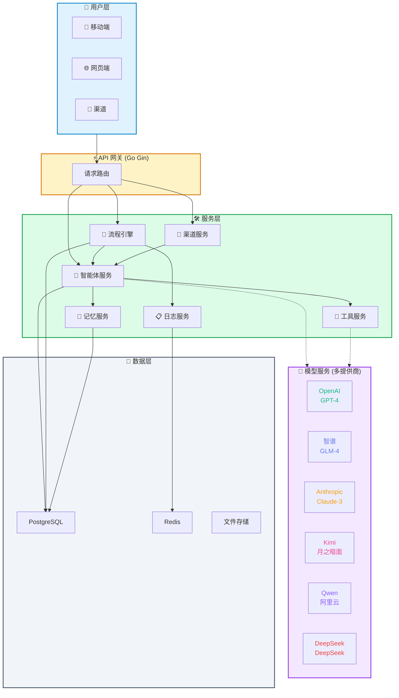

# CorpFlow

<p align="center">
  
</p>

**多智能体协作平台**

[](https://opensource.org/licenses/MIT)
[](https://flutter.dev)

> **English**: [README.md](./README.md)

---

## 概述

CorpFlow 是一个**多智能体协作平台**，支持：
- 创建和管理 AI 智能体
- 拖拽式可视化流程编排
- 多渠道部署（飞书、微信、Telegram、Discord）
- 多模型投票决策

---

## 架构图



### 组件说明

| 组件 | 颜色 | 描述 |
|------|------|------|
| **用户层** | 🔵 蓝色 | 移动端/Web/渠道用户 |
| **API 网关** | 🟡 黄色 | Go Gin 请求路由 |
| **服务层** | 🟢 绿色 | 核心业务逻辑 |
| **模型服务** | 🟣 紫色 | 7+ AI 提供商 |
| **数据层** | ⚫ 灰色 | PostgreSQL/Redis/文件 |

---

## 为什么选择 CorpFlow？（对比 OpenCode, OpenClaw, Claude Code, Super Powers）

| 功能 | CorpFlow | OpenCode | OpenClaw | Claude Code | Super Powers |
|------|----------|----------|----------|-------------|--------------|
| **多渠道** | ✅ 飞书/微信/Telegram/Discord | ❌ | ✅ | ❌ | ❌ |
| **移动端** | ✅ iOS/Android/Windows/Mac | ❌ | ❌ | ❌ | ❌ |
| **可视化流程编辑** | ✅ 拖拽式 | ❌ | ❌ | ❌ | ✅ |
| **多模型投票** | ✅ 7+ 模型 | ❌ | ❌ | ❌ | ❌ |
| **记忆系统** | ✅ 层级智能体 | ❌ | ✅ | ❌ | ❌ |
| **代码工具** | ✅ Shell/Git/审查/测试 | ✅ | ✅ | ✅ | ❌ |
| **执行日志** | ✅ 步骤级追踪 | ✅ | ✅ | ✅ | ✅ |
| **模板库** | ✅ 8+ 预置模板 | ❌ | ❌ | ❌ | ❌ |

### CorpFlow 优势：

1. **🔀 可视化流程编辑器** - 不同于 CLI 工具，提供拖拽式可视化工作流

2. **🗳️ 多模型投票** - 独特功能！让多个 AI 模型讨论并投票选出最佳答案

3. **📱 移动端支持** - 完整的 iOS、Android、Windows、macOS 应用

4. **💬 多渠道部署** - 同时部署到飞书、微信、Telegram、Discord

5. **🧠 层级记忆系统** - 上级可以查看下属工作历史并生成报告

6. **🔧 内置工具市场** - Shell、Git、代码审查、测试生成、网页搜索、文件操作

7. **⚡ 预置模板** - 8+ 个即用工作流：对话、投票、研究、客服、代码审查、内容创作、数据分析、新闻摘要

---

## 功能特性

| 功能 | 描述 |
|------|------|
| 🤖 **AI 智能体** | 创建自定义 AI 智能体，支持多种模型 |
| 🔀 **流程编排** | 拖拽式可视化工作流自动化 |
| 💬 **多渠道** | 飞书、微信、Telegram、Discord |
| 🗳️ **多模型投票** | 多个 AI 模型讨论并投票 |
| 📱 **移动端** | iOS、Android、macOS、Windows、iPadOS |
| 🔧 **工具市场** | Shell、Git、代码审查、测试生成 |
| 📋 **执行日志** | 步骤级执行追踪 |
| 🧠 **记忆系统** | 层级智能体关系 |

---

## 支持的 AI 模型

| 模型 | 提供商 | 环境变量 |
|------|--------|----------|
| GPT-4 / GPT-4 Turbo | OpenAI | `OPENAI_API_KEY` |
| Claude 3 Opus / Sonnet | Anthropic | `ANTHROPIC_API_KEY` |
| GLM-4 / GLM-4 Flash | 智谱 | `ZHIPU_API_KEY` |
| Kimi | 月之暗面 | `KIMI_API_KEY` |
| Qwen Turbo / Plus | 阿里云 | `DASHSCOPE_API_KEY` |
| DeepSeek Chat / Coder | DeepSeek | `DEEPSEEK_API_KEY` |
| MiniMax | MiniMax | `MINIMAX_API_KEY` |

---

## 快速开始

### 后端（Go + Docker）

```bash
# 克隆仓库
git clone https://github.com/gotonote/corpflow.git
cd corpflow

# 复制配置
cp .env.example .env

# 编辑 .env 填入你的 API Key
vim .env

# 使用 Docker 启动
docker-compose up -d
```

### 前端（React）

```bash
cd frontend

# 安装依赖
npm install

# 启动开发服务器
npm run dev

# 打开 http://localhost:3000
```

### 移动端（Flutter）

```bash
cd mobile

# 安装依赖
flutter pub get

# 开发运行
flutter run

# 构建 Android
flutter build apk --release
```

---

## 演示：如何使用可视化流程编辑器

### 第一步：打开流程编辑器

在网页界面点击 **Flows** 标签页。

### 第二步：从侧边栏拖拽节点

左侧边栏包含节点类型：

```
📦 节点库
├── ⚡ 触发器
│   ├── 消息触发
│   ├── 定时任务
│   └── Webhook
├── 🤖 智能体
│   └── 自定义 AI 智能体
├── 🧠 大模型
│   └── GPT-4 / Claude / GLM-4
├── 🔀 条件分支
│   └── If/Else 分支
├── 🔧 工具
│   ├── 浏览器
│   ├── 网页搜索
│   ├── 计算器
│   └── 代码执行
└── 📤 输出
    └── 返回结果
```

### 第三步：连接节点

1. 点击节点底部的 **连接点**（圆点）
2. 拖拽到另一个节点顶部的连接点
3. 松开鼠标创建连接

### 第四步：配置节点属性

点击任意节点打开右侧 **属性面板**：

```
⚙️ 节点配置
├── 名称："AI 助手"
├── 描述："主要智能体"
└── 模型：[GPT-4 ▼]
    ├── GPT-4
    ├── Claude 3 Sonnet
    └── GLM-4
```

### 第五步：保存和执行

```
┌─────────────────────────────────────┐
│ 💾 保存  │  ▶️ 执行  │ 📥 导入 │
└─────────────────────────────────────┘
```

- **保存**：将流程保存到数据库
- **执行**：使用当前输入运行工作流

### 示例流程：客服机器人

```
┌──────────┐    ┌──────────┐    ┌──────────┐    ┌──────────┐
│  触发器  │───▶│  智能体  │───▶│ 条件分支 │───▶│   输出    │
│ (用户消息)│    │(理解问题) │    │(已知问题?)│    │  (回复)   │
└──────────┘    └──────────┘    └──────────┘    └──────────┘
                              │
                    ┌─────────┴─────────┐
                    ▼                 ▼
              ┌──────────┐       ┌──────────┐
              │  知识库  │       │  转人工  │
              │  回答   │       │          │
              └──────────┘       └──────────┘
```

---

## 演示：多模型投票

### 启用投票

进入 **Settings** → 启用 **Multi-Model Voting**

### 工作原理

1. 用户提出问题
2. 多个 AI 模型同时响应
3. 模型互相评估答案
4. 通过共识选出最佳答案

### 示例

```
问题："如何提升产品的用户体验？"

┌────────────────────────────────────────────────┐
│ GPT-4 的回答                                    │
│ → 关注用户引导流程                             │
 │ → 得分: 85                                    │
├────────────────────────────────────────────────┤
│ GLM-4 的回答                                    │
│ → 添加个性化功能                               │
│ → 得分: 92 ⭐ (获胜)                           │
├────────────────────────────────────────────────┤
│ Kimi 的回答                                     │
│ → 提升移动端响应速度                           │
│ → 得分: 78                                    │
└────────────────────────────────────────────────┘

最终获胜者: GLM-4 (得分: 92)
```

---

## 演示：使用工具

### 可用工具

| 工具 | 描述 | 示例 |
|------|------|------|
| `shell` | 执行 Shell 命令 | `{"command": "ls -la"}` |
| `git` | Git 操作 | `{"action": "commit", "message": "fix bug"}` |
| `web_search` | 网页搜索 | `{"query": "CorpFlow AI"}` |
| `web_fetch` | 获取网页内容 | `{"url": "https://github.com"}` |
| `file_read` | 读取文件 | `{"path": "/app/main.go"}` |
| `file_write` | 写入文件 | `{"path": "/app/test.go", "content": "..."}` |
| `code_review` | AI 代码审查 | `{"code": "func main() {...}"}` |
| `test_gen` | 生成测试 | `{"code": "func Add(a,b int) int", "framework": "go"}` |
| `calculator` | 数学计算 | `{"expression": "100/5+20"}` |

### 运行工具示例

1. 进入 **Tools** 标签页
2. 选择一个工具（如 Calculator）
3. 输入：`{"expression": "100/5+20"}`
4. 点击 **Run**
5. 查看输出：`Result: 100/5+20 = 40`

---

## 如何使用各功能

### 1. 与 AI 对话

1. 进入 **Chat** 标签页
2. 选择一个智能体
3. 输入消息
4. 获取 AI 回复

### 2. 创建工作流

1. 进入 **Flows** 标签页
2. 从侧边栏拖拽节点
3. 连接节点
4. 配置属性
5. 保存并执行

### 3. 管理智能体

1. 进入 **Agents** 标签页
2. 点击 **+ 添加智能体**
3. 设置名称、模型、提示词
4. 保存

### 4. 查看执行日志

1. 进入 **Logs** 标签页
2. 查看所有工作流运行记录
3. 点击查看详情
4. 查看步骤级执行过程

---

## 连接移动端

连接移动端到本地服务器：

1. 确保手机和电脑在同一 WiFi 下
2. 获取电脑 IP：
   - Windows: `ipconfig`
   - Mac/Linux: `ifconfig`
3. 在移动端设置中输入：`http://你的IP:8080`

---

## 环境变量

```bash
# AI 模型
export OPENAI_API_KEY=sk-xxx
export ANTHROPIC_API_KEY=sk-ant-xxx
export ZHIPU_API_KEY=xxx
export KIMI_API_KEY=xxx
export DASHSCOPE_API_KEY=xxx
export DEEPSEEK_API_KEY=xxx
export MINIMAX_API_KEY=xxx

# 渠道
export FEISHU_APP_ID=xxx
export FEISHU_APP_SECRET=xxx
export WECHAT_APP_ID=xxx
export TELEGRAM_BOT_TOKEN=xxx
```

---

## 问题排查

| 问题 | 解决方案 |
|------|----------|
| 无法访问 localhost:3000 | 检查 Docker 是否运行：`docker ps` |
| API 调用失败 | 确认已在设置中配置 API Key |
| 移动端无法连接 | 检查防火墙 / 确保在同一网络 |
| 流程无法执行 | 检查所有节点是否正确连接 |

---

## API 接口

| 方法 | 接口 | 描述 |
|------|------|------|
| POST | `/api/agents` | 创建智能体 |
| GET | `/api/agents` | 列出智能体 |
| POST | `/api/flows` | 创建流程 |
| POST | `/api/flows/:id/execute` | 执行流程 |
| POST | `/api/tools/execute` | 执行工具 |
| GET | `/api/logs` | 获取执行日志 |
| POST | `/webhook/feishu` | 飞书 Webhook |

---

## 许可证

MIT License
